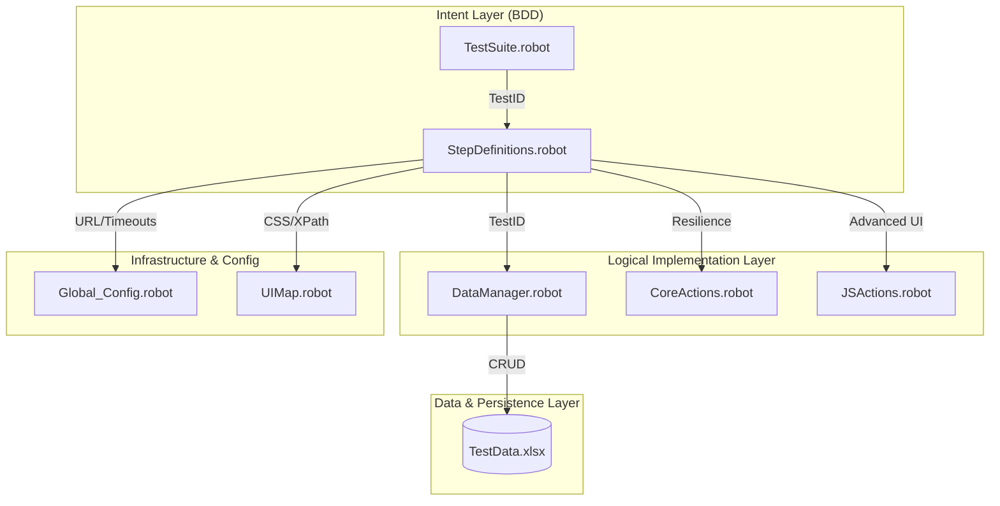

# 🚀 Smart BDD Data-Driven Framework (SDDF) : The Enterprise Blueprint

[](https://robotframework.org/)
[](https://robotframework.org/SeleniumLibrary/)
[]()

---

## 🏛️ 1. Framework Architecture & Vision

The **Smart BDD Data-Driven Framework (SDDF)** is a high-fidelity automation solution designed for massive scale and extreme resilience. It avoids the pitfalls of traditional "Linear DDT" by implementing a **Decoupled Data-Seeking Architecture**.

### 1.1 The "Data-Seeking" Pattern
In standard DDT, data is pushed into tests. In SDDF, tests are "Smart":
- **Tests** contain only behavioral intent steps and a unique `TestID`.
- **Keywords** are "Data-Aware"; they use the `TestID` to pull exactly the parameters they need from Excel at runtime.
- **Benefit**: Zero parameter-passing between layers, leading to the cleanest possible test scripts in the industry.

### 1.2 Multi-Layered Design (SoC)


---

## 🛠️ 2. Comprehensive Prerequisites & Installation

### 2.1 Technical Prerequisites
| Requirement | Specification |
| :--- | :--- |
| **Python** | 3.10+ (Recommended) |
| **Browsers** | Microsoft Edge (Default), Google Chrome, or Firefox. |
| **Drivers** | Framework uses `SeleniumLibrary` with automatic driver management support. |

### 2.2 Step-by-Step Setup Guide
Follow these steps to initialize the framework on a new machine:

1.  **Clone the Repository**:
    ```powershell
    git clone <your-repo-url>
    cd SDDF_Framework
    ```
2.  **Environment Isolation (Virtual Env)**:
    ```powershell
    python -m venv venv
    .\venv\Scripts\Activate.ps1   # Windows
    # source venv/bin/activate    # Linux/Mac
    ```
3.  **Core Installation**:
    ```powershell
    pip install -r requirements.txt
    ```

---

## ⚙️ 3. Strategic Configuration (Global_Config.robot)

The framework is "Configuration-First," allowing you to change environment and browser behavior without touching a single line of code.

### 3.1 The 4-Stage Timing Model
Flakiness is engineered out via a refined synchronization strategy:
- **`${WAIT_TIME}`**: `10s` - The maximum threshold for an element to appear.
- **`${DELAY}`**: `500ms` - The heartbeat used for **Fluent Wait** retries.
- **`${IMPLICIT_WAIT}`**: `5s` - The primary DOM polling used by the browser.
- **`${PAGE_LOAD_TIMEOUT}`**: `30s` - Blocks execution until `document.readyState` is 'complete'.

### 3.2 Stealth & Noise Suppression
Settings to ensure professional terminal output:
- **`${BROWSER_LOG_LEVEL}`**: `3` (Error Only) - Mutes internal browser telemetry and "renderer" noise.
- **`${HEADLESS}`**: Run in background for CI/CD.
- **`${INCOGNITO}`**: Ensures every test starts with a 100% clean cache.

---

## 🏗️ 4. Master Keyword Encyclopedia

The framework exposes a rich API of keywords categorized by their engineering purpose.

### 4.1 "Smart" Interaction Keywords (Intent Layer)
- `Load Test Data ${TestID}`: Fetches Excel row data into the `${TEST_DATA}` dictionary.
- `Launch Application`: Opens browser with architect-level stealth settings.
- `Update Execution Timestamp ${TestID}`: Writes back to Excel.

### 4.2 Fluent Wait Resilience (Resilience Layer)
- `Fluent Wait For Element`: Polling-based visibility check.
- `Fluent Click Element`: Clicks only when visible + enabled.
- `Fluent Input Text`: Clears -> Waits -> Inputs.
- `Fluent Select From List`: Handles standard `<select>` dropdowns.
- `Fluent Select Custom`: Handles `<div>`/`<ul>` based dropdowns effectively.

### 4.3 🎲 Data Utilities (Generation Layer)
Robust tools for creating unique test data on the fly.
- `Generate Random Number String`: Creates 10-digit unique IDs (configurable).
- `Generate Random Name`: Creates realistic alphabetic names.
- `Get Current Date Time String`: Returns `YYYYMMDD_HHMMSS`.
- `Concat With Random Number`: Helper: `Input` -> `Input8473829102`.
- `Concat With Timestamp`: Helper: `Report` -> `Report_20240101_120000`.

### 4.4 JavaScript Executor API (The "Magic" Layer)
Use these when standard Selenium interactions fail (e.g., hidden elements, overlays, React/Angular apps).
- **Interaction**: `JS Click Element`, `JS Clear And Input`, `JS Input Text`.
- **State**: `JS Get Text`, `JS Get Value`, `JS Is Element Visible`.
- **Navigation**: `JS Scroll To Element`, `JS Scroll To Top/Bottom`, `JS Scroll By`.
- **Debugging**: `JS Highlight Element` (draws red border), `JS Set Attribute`, `JS Remove Attribute`.
- **Waits**: `JS Wait For Page Load` (document.readyState), `JS Wait For Ajax` (jQuery.active).

### 4.5 📊 Dynamic Data Persistence & Strategy
The framework uses a **Dictionary-based** approach for data.

#### Reading Data
Once `Load Test Data` is called, data is available in the `${TEST_DATA}` dictionary.
```robot
Log    Username is: ${TEST_DATA}[username]
Input Text    ${LOGIN_INPUT}    ${TEST_DATA}[password]
# Data Utils Usage
${unique_user}=    Concat With Random Number    User
```

#### Writing Data
You can write to *any* column by name using `Write Data To Excel`.
- **`Write Result To Excel`**: Updates `Result` column (PASS/FAIL).
- **`Write Data To Excel`**: Updates any column (e.g., `Execution_Time`).
```robot
# usage: Write Data To Excel  TestID  ColumnName  Value
Write Data To Excel    TC_01    Execution_Time    2024-01-01 12:00:00
```

---

## 🚀 5. Comprehensive Execution Manual

### 5.1 Standard Local Execution
To run all test cases in the suite:

```powershell
robot --outputdir Results Tests/TestSuite.robot
```

### 5.2 Enterprise CLI Overrides (The Senior Method)
One of the most powerful features of the framework is the ability to override *any* property from the CLI.
```powershell
# Headless run in an Incognito Chrome session
robot --variable BROWSER:chrome --variable HEADLESS:True --variable INCOGNITO:True Tests/

# Override URL for Staging environment
robot --variable URL:https://staging.app.com Tests/

# Tuning timing for slow networks
robot --variable WAIT_TIME:25s --variable DELAY:1s Tests/
```

### 5.3 Filtered Runs (Precise Execution)
You can run a single test case or a group of tests using tags.

**Run a Specific Test Case by Name:**
```powershell
robot --test "TC_01 Valid Login Test" --outputdir Results Tests/
```

**Run using Wildcards (Glob Patterns):**
```powershell
# Runs all tests starting with TC_0
robot --test "TC_0*" --outputdir Results Tests/
```

**Run by Tag (Smoke/Regression):**
```powershell
robot --include smoke --outputdir Results Tests/
```

---

## 📊 6. Data Strategy (TestData.xlsx)

The Excel file is the source of truth for all test cases.

### 6.1 Column Schema (Order Agnostic)
| Column | Header Name | Purpose |
| :--- | :--- | :--- |
| **Primary** | `TestID` | The key used for "Smart" lookup logic. |
| **Logic** | `username`, `password` | Test-specific parameters. |
| **Output** | `Result` | Automatically populated with PASS/FAIL status. |
| **Output** | `Execution_Time` | Automatically updated with the run timestamp. |

> [!TIP]
> **SDDF is Column-Order Agnostic.** As long as the **Header Names** match the expected strings, you can move, add, or delete any columns (except `TestID`) without breaking the engine.

---

## 📁 7. Standard Repository Structure

Designed for high cohesion and low coupling.
- **`Data/`**: Global Excel source and bi-directional result store.
- **`Resources/Config/`**: Global environment and timing variables.
- **`Resources/DataManager/`**: The core Excel CRUD engine.
- **`Resources/UIMap/`**: The centralized Page Object Model (POM) Layer.
- **`Resources/Steps/`**: The BDD Step Definition and Action Layer.
- **`Tests/`**: Behavioral test suites.
- **`Results/`**: Traceable logs, statistics, and high-res evidence.

---

## 🛠️ 8. Extension Guide: Adding New Capability

### How to Add a New Test Case
1.  Add a new row in `TestData.xlsx` with a new `TestID` (e.g., `TC_06`).
2.  Add a new test in `TestSuite.robot` calling `Load Test Data TC_06`.

### How to Add a New UI Locator
1.  Open `Resources/UIMap/LoginPage.robot` (or create a new page file).
2.  Define your variable (e.g., `${NEW_BUTTON}  css=.btn-action`).

### How to Add a New Step
1.  Define it in `Resources/Steps/BusinessSteps.robot` (or `CoreActions.robot`).
2.  Always use `Fluent` or `JS` variants for maximum stability.

---

## 🛡️ 9. Troubleshooting & CI/CD

### Common Issues
- **Excel Locked**: Close `TestData.xlsx` before running; the framework needs write access.
- **Driver Mismatch**: The framework will attempt to auto-resolve, but ensure your browser is up to date.

### CI/CD Integration (GitHub Actions / Azure DevOps)
SDDF is designed for headless servers. Simply use the `--variable HEADLESS:True` flag in your pipeline YAML.

---

**Architected by Bhoopesh D** 🚀  
*Engineered for Truth. Built for Scale.*
